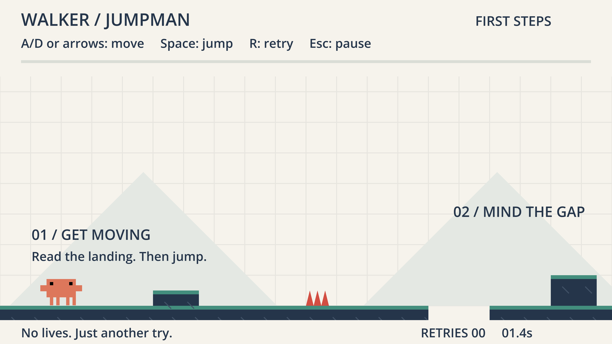

# walker-jumpman-clawd — Professor Bear's evolving example

**Iteration 1: Clawd in the existing First Steps level.** The starter remains
untouched in its own repository. This independent project is
[nikbearbrown/walker-jumpman-clawd](https://github.com/nikbearbrown/walker-jumpman-clawd).

```sh
git clone https://github.com/nikbearbrown/walker-jumpman-clawd.git
cd walker-jumpman-clawd
godot --path godot
```

Or import `godot/project.godot` in the regular Godot editor and press F5. On Mac,
double-click [walker-jumpman-clawd.command](walker-jumpman-clawd.command).
Enter starts; A/D or arrows move; Space jumps; R retries; Escape/P pauses.

Open [clawd-gallery.command](clawd-gallery.command) for all 18 animations, or
run `godot --path godot res://gallery/clawd_gallery.tscn`. Arrow keys change
pages, Space toggles automatic paging, C shows the collision reference, Esc exits.
This is a **separate visual gallery, not 18 new gameplay abilities**.

Gameplay chooses idle, walk, run, a held airborne jump pose, error on failure,
and celebrate at completion. Pause freezes the pose. The wide art extends beyond
the original 18 × 28 collision box; that tradeoff needs human inspection.

[Change brief](CHANGE-BRIEF.md) · [Frictional effort log](FRICTIONAL.md) ·
[Sources and human/AI contributions](SOURCES.md)



The 25 starter mechanics checks, nine keyboard checks, and sampled animation
parity/presentation tests pass. [Current status](CLAWD-STATUS.json) is separate
from inherited starter records. Run the checks from this repository:

```sh
godot --headless --path godot --script res://tests/test_game.gd --fixed-fps 60
godot --headless --path godot --script res://tests/test_keyboard.gd --fixed-fps 60
godot --headless --path godot --script res://tests/test_clawd.gd --fixed-fps 60
node scripts/clawd-build.cjs
```

**Start early. Make one change, test it, and record what happened.** A failed
attempt can be progress; it is not evidence that the feature works. The future
game will use task mini-goals and a completed agentic loop. Those mechanics, new
hazards, and the required Assignment 1 level extension are **not built yet**.
This character pass is not a completed assignment or a human playtest.

## Historical starter documentation (September 10, 2026)

The material below describes the original starter, not the current Clawd
iteration. Inherited GDD, DESIGN-STATUS, BUILD-REPORT, and evidence are historical;
the current scope is the change brief above. Historical launcher paths and images
refer to the starter. New receipts are recorded separately.

**Playable source prototype · September 10, 2026 · Godot 4.7.2 / GDScript**

Standalone game repository: [nikbearbrown/walker-jumpman](https://github.com/nikbearbrown/walker-jumpman). This checkout contains only this game's source, design package, and test evidence—not the Walker toolkit, Brutalist, or video renders.

Clone with `git clone https://github.com/nikbearbrown/walker-jumpman.git`, then import `walker-jumpman/godot/project.godot` in the regular Godot editor. No .NET runtime or external assets are required. On macOS, the launcher below also works when Godot is installed in Applications; on other platforms, use the editor or `godot --path godot` from the cloned folder.

Double-click [walker-jumpman.command](walker-jumpman.command) to play. Press **Enter** to start; **A/D or arrows** to move, **Space** to jump, **R** to retry, and **Escape/P** to pause. Reach the flag. Retries are unlimited.


This simple level has two steps, two gaps, one spike hazard, and a finish. It is the control/retry slice, not the full three-zone/cherry design below. See [build results and limitations](BUILD-REPORT.md). To edit, import [godot/project.godot](godot/project.godot) into Godot.

The first Walker example is a compact 2D platformer built around readable jumps, optional cherries and quick retries. Every new game project uses the `walker-` prefix. The original `jumping-man-godot` recovery collection remains separate and unchanged; it is not included or required here. Historical design references to sibling recovery files refer to the author's local source collection, not files shipped in this repository.

## Read in this order

1. [Game brief](GAME-BRIEF.md) — the short player-facing idea and proposed scope.
2. [Detailed GDD](GDD.md) — sixteen design sections, source evidence, requirements and twenty-two acceptance cases.
3. [Level design](LEVEL-DESIGN.md) — the three-zone course and its untested geometry.
4. [Production plan](PRODUCTION-PLAN.md) — twenty-two dependency-ordered tasks across six phases, plus four deferred tasks.
5. [Playtest plan](PLAYTEST-PLAN.md) — mechanical tests, formative human sessions, evidence and revision rules.
6. [Asset plan](ASSET-PLAN.md) — original greybox requirements and the provenance boundary.
7. [Design status](DESIGN-STATUS.json) — machine-readable revision, decisions, pending approvals and honest runtime state.


[Design consistency review](DESIGN-REVIEW.md) · [Editable SVG map](design/level-overview.svg)

[Level coordinate data](design/level-01.json) drives this candidate blockout. Counts and geometry can be checked without Godot. Jump reachability, zero-cherry/all-cherry routing, camera behavior and enjoyment have not been tested.

## Proposed defaults ready for review

Godot 4 with typed GDScript, Compatibility rendering, one three-zone level, twenty optional cherries, one fixed-height jump with small forgiveness windows, hazards, quick retries, keyboard controls and a locally tested Web export. No paid services. No moving-platform dependency in the MVP.

The tested engine is Godot 4.7.2.stable.official.ed1daf0bf. Zelda's reusable prompt and command/workflow specification belong to the separate Walker toolkit and are not dependencies of this game.

## Current boundary

The full design is still a draft. Bear subsequently authorized **“Build a simple level for walker-jumpman.”** The first slice is implemented and machine-tested; full-design approvals, human playtesting, cherries/settings, and the Web export remain pending. This is a source-code release, not a hosted game or downloadable executable. The build report and test receipts preserve the earlier local-build history.

Next: play this small control/retry loop before expanding the course. The human owns intent, scope, play-feel judgments, and release decisions; AI implements and checks authorized work. The original `/Users/bear/walker-jumpman` stays untouched.
